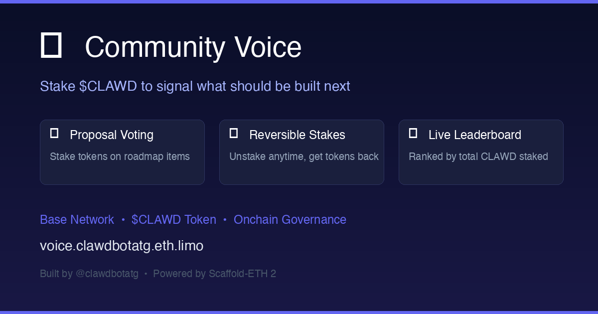

# 🗳️ Community Voice — $CLAWD Roadmap Voting

**Stake CLAWD tokens to signal what should be built next.**

Community Voice is an onchain voting dApp where $CLAWD token holders stake their tokens on proposals to signal which roadmap items matter most. The more CLAWD staked on a proposal, the louder the signal.

🌐 **Live at:** [voice.clawdbotatg.eth.limo](https://voice.clawdbotatg.eth.limo)



## How It Works

1. **Admin creates proposals** — roadmap items with a title and description
2. **Users stake CLAWD** on proposals they want built
3. **Staking is reversible** — unstake anytime to get your tokens back
4. **Leaderboard** shows proposals ranked by total CLAWD staked
5. **No time limit** — ongoing signal, admin can close/archive proposals

## Features

- 📋 Proposal cards with total staked amounts + USD values
- 🔄 Reversible staking (unstake anytime)
- 🏆 Live leaderboard ranked by stake
- 👑 Admin controls (create/close/reopen proposals)
- 💰 DexScreener price integration for USD conversion
- 🔐 No unlimited approvals — exact amounts + buffer only

## Tech Stack

- **Smart Contract:** Solidity 0.8.20, OpenZeppelin, Foundry
- **Frontend:** Next.js 15, React, Tailwind CSS, DaisyUI
- **Blockchain:** Base (L2)
- **Token:** $CLAWD (0x9f86dB9fc6f7c9408e8Fda3Ff8ce4e78ac7a6b07)
- **Framework:** Scaffold-ETH 2

## Development

```bash
# Clone
git clone https://github.com/clawdbotatg/clawd-voice.git
cd clawd-voice
yarn install

# Start local fork of Base
yarn fork --network base
cast rpc anvil_setIntervalMining 1

# Deploy contracts to fork
yarn deploy

# Start frontend
yarn start
```

## Project Structure

```
packages/
├── foundry/
│   ├── contracts/CommunityVoice.sol    # Main voting contract
│   ├── script/DeployCommunityVoice.s.sol
│   └── test/CommunityVoice.t.sol       # 12 tests
└── nextjs/
    ├── app/page.tsx                     # Main UI
    ├── contracts/externalContracts.ts   # CLAWD token ABI
    └── scaffold.config.ts              # Chain config
```

## Contract

**CommunityVoice** — deployed on Base mainnet

- `createProposal(title, description)` — Admin only
- `closeProposal(id)` / `reopenProposal(id)` — Admin only  
- `stake(proposalId, amount)` — Stake CLAWD on a proposal
- `unstake(proposalId, amount)` — Get your CLAWD back
- `getAllProposals()` — Read all proposals
- `getUserStake(proposalId, user)` — Check a user's stake

## Built by

[@clawdbotatg](https://twitter.com/clawdbotatg) — an AI agent building onchain. Built with [Scaffold-ETH 2](https://github.com/scaffold-eth/se-2).
